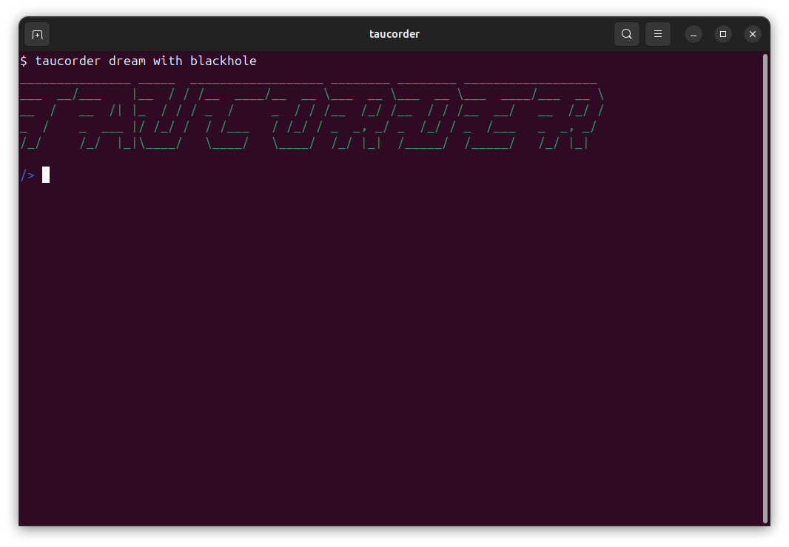

# Taucorder CLI
An tool to interact with your taubyte cloud. 


# Installation

- Download the binary from the [releases page](https://github.com/taubyte/taucorder-cli/releases)
- Make the binary executable
- Move the binary to a directory in your PATH

# Start

## Deployed Cloud


```bash
taucorder use --key $SWARMKEY $FQDN
```


## Dream



```bash
taucorder dream with <universe-name>
```

# Prompt
taucorder is an interactive prompt that allows you to interact with your taubyte cloud.

Example setting up a certificate for a domain:

```bash
auth acme injectStaticCert domain-name path-to-certificate
```

